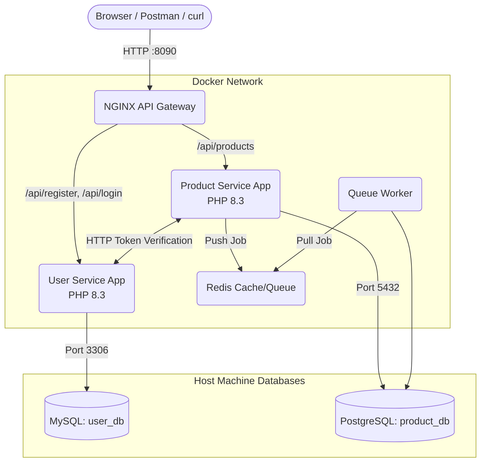
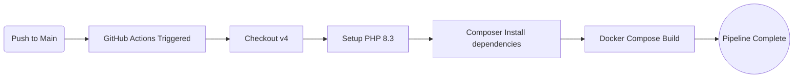

# Architecture and FAQ Guide

This document explains the technical architecture of this Laravel microservice project and answers common questions about how the environment (Docker, CI/CD, and networking) operates.

---

## 1. Architecture Diagram & Flow

This project utilizes a modern microservice architecture, orchestrated by Docker Compose, and automated via GitHub Actions CI/CD.

### Microservices & Docker Flow

**How a Request Flows:**
1. A user makes a request to `localhost:8090`.
2. The **NGINX API Gateway** intercepts the request and checks the URL path.
3. If it's `/api/register` or `/api/login`, NGINX routes it to the **User Service**.
4. If it's `/api/products`, NGINX routes it to the **Product Service**.
5. When creating a product, the **Product Service** sends an internal HTTP request back to the **User Service** to validate the Sanctum Auth Token before saving the product to the database.

### CI/CD Pipeline Flow (GitHub Actions)

---

## 2. Frequently Asked Questions

### Q1: Would this microservice run from a Docker image only?
**No!** You are not forced to use Docker. Because this is a standard Laravel 11 application, you can run it completely standalone on your local computer by simply navigating into the `user-service` or `product-service` folders and running `php artisan serve`.

However, you would need to ensure you have PHP 8.3 and Composer installed natively on your machine, and you would need to manage the ports (e.g., running one on port 8000 and the other on 8001). Docker is simply a tool we use to bundle it all together.

### Q2: What is the purpose of Docker here?
Docker provides three massive benefits for this project:
1. **Environment Isolation**: It guarantees the apps run on exactly PHP 8.3 with the exact required extensions, no matter what computer you run it on.
2. **Network Routing (The Gateway)**: Docker allows us to run an NGINX container that acts as a traffic director, making both microservices look like a single API to the outside world.
3. **"It works on my machine"**: Anyone who downloads your portfolio project can just run `docker compose up -d` and it will instantly work, without them needing to manually configure PHP, NGINX, or Redis on their personal computers.

### Q3: `php artisan optimize:clear` did not work on my host machine. Does that mean it will not run standalone without Docker?
It **can** run standalone, but the reason that command failed is purely due to a configuration setting in your `.env` file! 

Your `.env` file currently contains `DB_HOST=host.docker.internal`. This is a special instruction telling Laravel to talk to the Docker network. When you run a command directly on your host machine (outside of Docker), your computer doesn't know what `host.docker.internal` is, so it crashes. 
If you simply changed it back to `DB_HOST=127.0.0.1`, you could run `php artisan` commands (and run the app natively) without any issues!

### Q4: Every time I restart, do I have to kill the processes and run docker-compose down and up?
**No, you do not!** 
The `sudo pkill -9` commands were a one-time workaround for a specific bug caused by Ubuntu's Snap package manager, which was temporarily blocking Docker from stopping containers.

Moving forward, because we added `restart: unless-stopped` to your `docker-compose.yml` file, **your containers will now automatically start in the background the moment you turn your computer on.** You don't need to run any commands at all to boot them up!

### Q5: Can I run this in the browser? If so, what is the URL?
**Yes**, but with a limitation!
Because this is an **API** (not a frontend website with HTML), you can only test `GET` requests in a standard web browser. 

For example, if you type this into your browser's address bar:
`http://localhost:8090/api/products`
It will successfully return the list of products in JSON format.

However, you *cannot* test `POST` requests (like logging in or creating a product) by just typing a URL into a browser. For those, you must use `curl` in the terminal, a tool like Postman, or a frontend application (like React/Vue).

### Q6: When I try to run it in the browser, it gives a DNS error. Why?
You will get a DNS error if you try to type an internal Docker address into your host machine's browser (e.g., `http://user-app:8000` or `http://host.docker.internal`). 

Your web browser (Chrome, Firefox) lives on your host computer, and it has no access to Docker's internal, hidden DNS names. The **only** URL your web browser understands is the public port exposed by the NGINX Gateway, which is `http://localhost:8090`. All interactions from your host computer must go through that `localhost` address!
