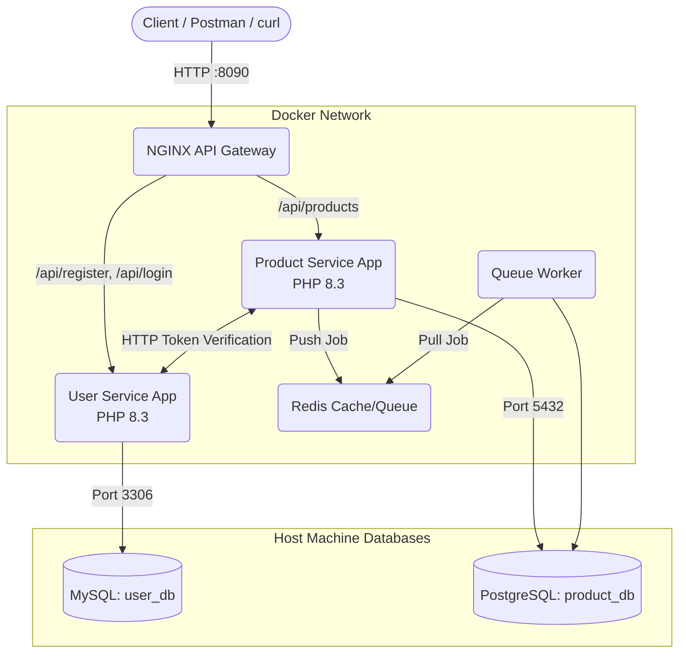
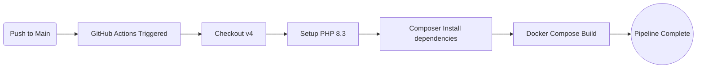

# Microservices Demo Project

This is a demonstration project containing two Laravel microservices, an API gateway, Docker, and CI/CD pipelines.

## Setup and Run

### 1. Database Configuration
This project uses your host machine's existing databases.
It assumes:
- **MySQL**: running on host port 3306, user `mymicro`, password `sujaymicro`. Database `user_db`.
- **PostgreSQL**: running on host port 5432, user `mymicro`, password `sujaymicro`. Database `product_db`.

*(If you wanted to use completely isolated containerized databases instead of the host machine's, you would add `mysql` and `postgres` service blocks to `docker-compose.yml` and remove the `extra_hosts` configuration. But per our setup, it points to the host).*

### 2. Run the Environment
Make sure your local MySQL and PostgreSQL services are running. Then execute:
```bash
cd /var/www/html/microservice-demo
docker-compose up -d --build
```
This will start:
- `user-app` (Port 8001)
- `product-app` (Port 8002)
- `gateway` (NGINX API Gateway, Port 8090)
- `redis` (Port 6380)
- `queue-worker` (Background jobs)

### 3. How to Test & Login
You can interact with the system via the API Gateway running on port `8090`.

**Register a User:**
```bash
curl -X POST http://localhost:8090/api/register \
-H "Accept: application/json" \
-H "Content-Type: application/json" \
-d '{"name": "John Doe", "email": "john@example.com", "password": "password"}'
```
*You will receive an `access_token` in the response.*

**Login:**
```bash
curl -X POST http://localhost:8090/api/login \
-H "Accept: application/json" \
-H "Content-Type: application/json" \
-d '{"email": "john@example.com", "password": "password"}'
```
*You will receive an `access_token`.*

**Create a Product (Requires Auth):**
Copy the `access_token` you got from the login step and use it as a Bearer token:
```bash
curl -X POST http://localhost:8090/api/products \
-H "Accept: application/json" \
-H "Content-Type: application/json" \
-H "Authorization: Bearer YOUR_ACCESS_TOKEN" \
-d '{"name": "Laptop", "price": 999.99, "description": "High-end laptop"}'
```
*The `product-service` will intercept this request, communicate with `user-service` to validate the Sanctum token, extract the authenticated user's ID, and save the product with the `user_id` mapping!*

**List Products:**
```bash
curl -X GET http://localhost:8090/api/products
```
*(You will now see the `user_id` field in the returned product JSON)*

---

## Architecture & Pipeline Diagrams

### Microservices & Docker Flow


### CI/CD Pipeline Flow (GitHub Actions)


### Health Endpoints
- User Service Health: `http://localhost:8090/api/health` (Routed to user-service)
